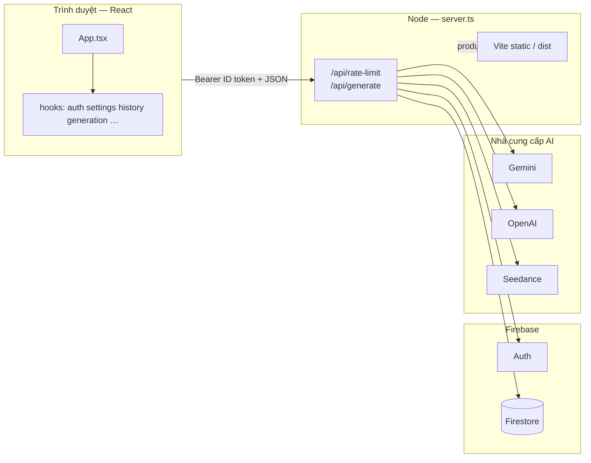
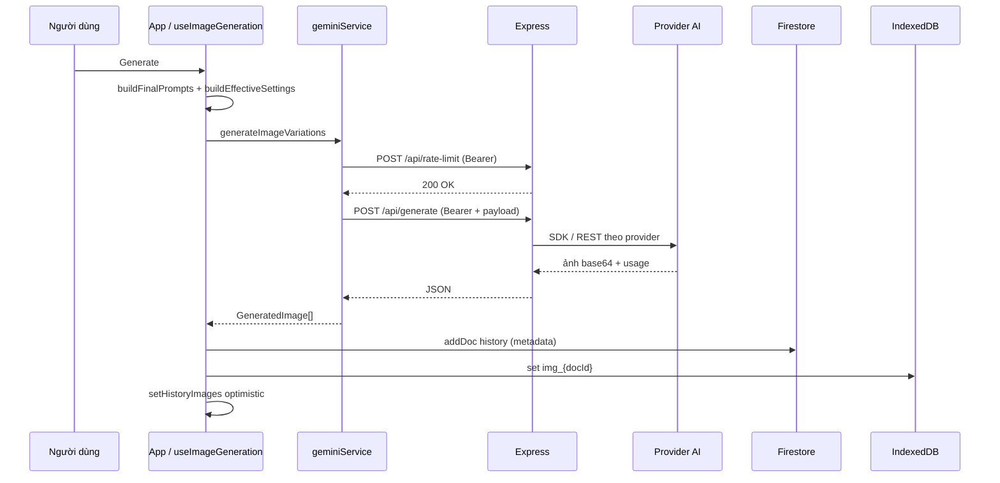
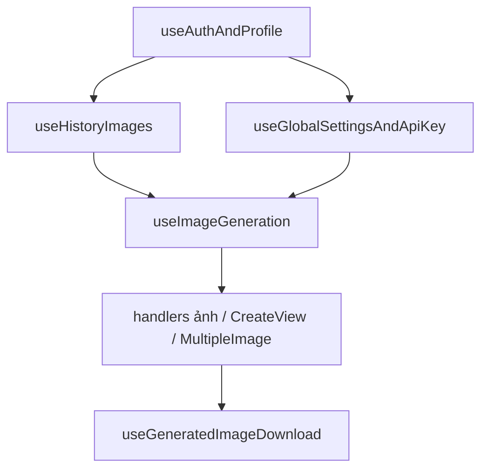

# Tài Liệu Tổng Quan Dự Án AI Image ZVAS

Dự án này là một ứng dụng web hiện đại cho phép người dùng tạo hình ảnh bằng AI (Gemini, OpenAI, Seedance) với nhiều tùy chọn phong cách, quản lý lịch sử và hệ thống Admin toàn diện.

---

## 1. Tổng Quan (Overview)

- **Tên ứng dụng**: AI Image ZVAS
- **Mục tiêu**: Cung cấp công cụ tạo ảnh AI chuyên nghiệp dành cho người dùng cá nhân và doanh nghiệp.
- **Tính năng chính**:
  - Tạo ảnh từ văn bản (Text-to-Image).
  - Chỉnh sửa ảnh từ ảnh gốc (Image-to-Image).
  - Trộn ảnh (Merge Image).
  - Tạo nhiều biến thể cùng lúc.
  - Quản lý lịch sử tạo ảnh cá nhân.
  - Bảng điều khiển Admin để quản lý người dùng và cấu hình API.

---

## 2. Kiến Trúc Frontend

Sử dụng các công nghệ hiện đại nhất để đảm bảo hiệu năng và trải nghiệm người dùng mượt mà.

- **Framework**: [React 19](https://react.dev/) + [TypeScript](https://www.typescriptlang.org/).
- **Công cụ xây dựng**: [Vite 6](https://vitejs.dev/).
- **Styling**: [Tailwind CSS 4](https://tailwindcss.com/) (tiếp cận Utility-first, giao diện tối ưu cho Dark Mode).
- **Icons**: [Lucide React](https://lucide.dev/).
- **Thông báo**: [Sonner](https://sonner.steventey.com/).
- **Lưu trữ local**: [idb-keyval](https://github.com/jakearchibald/idb-keyval) (IndexedDB để lưu blob ảnh lớn theo ID document lịch sử).

### 2.1. Cấu trúc thư mục (frontend, rút gọn)

| Đường dẫn             | Mô tả                                                                                                                   |
| --------------------- | ----------------------------------------------------------------------------------------------------------------------- |
| `App.tsx`             | Điều phối: điều kiện auth, ghép hooks, chọn view (Create / Merge / Multiple), overlay (Style Guide, Fullscreen, Admin). |
| `index.tsx`           | Entry React; bọc `ErrorBoundary`.                                                                                       |
| `components/`         | UI tái sử dụng (upload, prompt, kết quả, merge, multiple, admin, …).                                                    |
| `components/layout/`  | `AuthLoadingScreen`, `AppHeader`, `AppFooter`.                                                                          |
| `components/landing/` | `LandingPage` (chưa đăng nhập).                                                                                         |
| `components/guards/`  | `RejectedAccessScreen` (tài khoản bị từ chối).                                                                          |
| `components/views/`   | `CreateView` (toàn bộ màn Create).                                                                                      |
| `hooks/`              | Logic tách khỏi `App`: auth, settings, history, generation, download, pending users.                                    |
| `lib/`                | `buildGenerationPrompts.ts`: ghép prompt cuối + `buildEffectiveSettings` cho model theo provider.                       |
| `constants/`          | `aiModels.ts`, `promptModifiers.ts` (map style/nền).                                                                    |
| `services/`           | `geminiService.ts` (gọi `/api/*`), `analyticsService.ts`.                                                               |
| `utils/`              | `imageDataUrl`, `aspectRatio`, `runtimeEnv`.                                                                            |

### 2.2. Custom hooks (`hooks/`)

- **useAuthAndProfile**: Firebase Auth + snapshot `users/{uid}`; `onSignedOut` gọi `resetAppState` từ App; `handleLogin` / `handleLogout`.
- **useGlobalSettingsAndApiKey**: Cache `sessionStorage`, kiểm tra AI Studio / env, `onSnapshot(settings/global)` khi đã đăng nhập; `getProviderKey`, `getEffectiveModel`, `handleSelectApiKey`.
- **useHistoryImages**: Đọc `history` + ảnh từ IndexedDB; xóa lịch sử; đồng bộ khi `user` thay đổi (logout → danh sách rỗng).
- **usePendingUsersNotifier**: Admin lắng nghe user `pending`, badge + toast (mở dashboard).
- **useImageGeneration**: Trạng thái `isLoading` / `generatedImages`; `handleGenerateClick` (prompt pipeline, gọi API, analytics, ghi Firestore + IDB, cập nhật history optimistically); khi `user === null` xóa state generation.
- **useGeneratedImageDownload**: Xuất PNG/JPG và tùy chọn xóa nền client-side.

### 2.3. Entry & shell dev/prod

- `**npm run dev`**: `tsx server.ts` — Express + Vite middleware (HMR).
- `**npm run build`**: output `dist/`; `**npm start**`: Express phục vụ `dist` + API.

### 2.4. Sơ đồ kiến trúc (Mermaid)

**Tổng thể: trình duyệt, server, Firebase và nhà cung cấp AI**

**Luồng tạo ảnh (một prompt)**

**Ghép hook trong `App.tsx` (thứ tự gọi)**

> Gợi ý: GitHub và nhiều renderer Markdown hiển thị Mermaid trực tiếp; nếu viewer không hỗ trợ, copy khối code vào [mermaid.live](https://mermaid.live).

---

## 3. Kiến Trúc Backend & Database

Hệ thống sử dụng mô hình Full-stack với Express và Firebase.

- **Server**: [Express 5](https://expressjs.com/) chạy trên môi trường Node.js (`server.ts`).
- **Database**: [Firebase Firestore](https://firebase.google.com/docs/firestore).
  - Thông tin người dùng (`users`).
  - Lịch sử metadata (`history`; `imageUrl: 'idb'` khi blob lưu ở IndexedDB).
  - Cấu hình (`settings/global`).
  - Analytics (`analytics_events`), chi phí thủ công (`monthly_costs`).
- **Authentication**: [Firebase Auth](https://firebase.google.com/docs/auth) (đăng nhập Google).
- **Security Rules**: Phân quyền theo role (user/editor/admin); Admin cấu hình key trong `settings/global` — rules phải bảo vệ field nhạy cảm.

---

## 4. API & AI Models

Ứng dụng tích hợp đa dạng các nhà cung cấp AI:

- **Gemini API (Google)**:
  - Model mặc định (cấu hình được): ví dụ `gemini-3.1-flash-image-preview`.
  - Image generation qua backend SDK `@google/genai`.
- **OpenAI API**: Model `DALL-E 3`.
- **Seedance API**: Model `seed-1.5-pro` (URL base có thể cấu hình).
- **Cơ chế thực thi**:
  - Frontend không gọi trực tiếp nhà cung cấp AI bằng API key công khai.
  - Frontend gọi `/api/rate-limit` rồi `/api/generate` kèm header `Authorization: Bearer <Firebase ID token>`.
  - Backend đọc provider/model từ Firestore `settings/global` và body request, sau đó gọi SDK/API tương ứng.
- **Thứ tự ưu tiên API key (backend)**:
  1. Biến môi trường (`GEMINI_API_KEY`, `OPENAI_API_KEY`, `SEEDANCE_API_KEY`).
  2. Firestore `settings/global` (do Admin cập nhật).

---

## 5. Luồng Công Việc (Workflow)

1. **Đăng nhập**: Đăng nhập Google; profile được tạo/cập nhật trong Firestore (role, status). Admin có thể duyệt user pending (toast + badge trong header).
2. **Cấu hình UI**: Style, aspect ratio, image size, prompt(s), ảnh chính / reference — khớp với pipeline trong `lib/buildGenerationPrompts.ts`.
3. **Rate limiting**: Mỗi lần generate (từng prompt), client gọi `POST /api/rate-limit`; server giới hạn **10 request/phút/user** (in-memory — khi scale nhiều instance cần chiến lược tập trung nếu muốn giới hạn toàn cục).
4. **Tạo ảnh**:
  - Client: `generateImageVariations` → `/api/generate` (multipart JSON ảnh base64 trong body).
  - Server: xác thực token, đọc settings, gọi Gemini/OpenAI/Seedance; trả base64 + usage metadata.
5. **Lưu trữ sau khi thành công**:
  - Firestore: document `history` (prompt, `imageUrl: 'idb'`, …).
  - IndexedDB: key `img_{docId}` chứa data URL/blob ảnh.
  - UI cập nhật history optimistically qua `useImageGeneration` + `useHistoryImages`.
6. **Analytics**: Ghi `image_generation_`*, `image_downloaded`, `user_login` vào `analytics_events` (dashboard admin).
7. **Tải xuống**: `useGeneratedImageDownload` — canvas, tuỳ chọn nền trong suốt / xóa nền heuristic.

---

## 6. Triển Khai (Deployment)

- **Môi trường**: Google Cloud Run (hoặc AI Studio Web App tùy pipeline của team).
- **Build & chạy**:
  - `npm run build`: Vite → `dist/`.
  - `npm start`: Express phục vụ static + API (`NODE_ENV=production`).
- **Port**:
  - Local: thường `3000` (hoặc `PORT` trong env).
  - Cloud Run: `process.env.PORT` (ví dụ `8080`).
- **Bảo mật release**:
  - Secret Manager / Cloud Run secrets cho API keys.
  - Không commit key thật; không nhét key vào biến `VITE_`* nếu có nguy cơ lộ ra bundle client.

---

## 7. Bảo Mật (Security Checklist)

- API key nhà cung cấp AI chỉ dùng trên backend (env / Secret Manager / Firestore admin-configured).
- `/api/generate` và `/api/rate-limit` yêu cầu Firebase ID token hợp lệ.
- Rate limit phía server giảm lạm dụng (lưu ý giới hạn trên một process).
- Firestore Rules khớp role user/admin.
- Session cache `global_settings` giảm đọc lặp; vẫn cần theo dõi quota Firestore.

---

## 8. Bảng Điều Khiển Admin (Admin Dashboard)

- **`role === 'admin'`**: đầy đủ tab **Người dùng**, **Cấu hình hệ thống**, **Analytics**; badge pending; toast duyệt user.
- **`role === 'advice'`**: chỉ **Analytics** (nút biểu đồ trên header); không quản lý user, không sửa cấu hình / chi phí thủ công / ngân sách trong UI. Firestore rules cho phép đọc `analytics_events`, `monthly_costs`, `users`, `history` (để bảng số ảnh theo user); ghi `monthly_costs` và cấu hình vẫn chỉ **admin**.
- **`role === 'editor'`**: không vào dashboard admin (trừ khi được nâng role).

Chi tiết tab admin:

- **Người dùng**: Danh sách, role (`admin` / `editor` / `advice`), trạng thái (pending/approved/rejected).
- **Cấu hình**: Khóa API và provider/model trong `settings/global`.
- **Analytics / chi phí**: Đọc từ `analytics_events` và `monthly_costs` (logic trong `services/analyticsService.ts`).

---

*Tài liệu cập nhật: tháng 5/2026 — phản ánh cấu trúc mã sau refactor (hooks, `lib/`, layout views), luồng API hiện tại, và sơ đồ Mermaid (§2.4).*