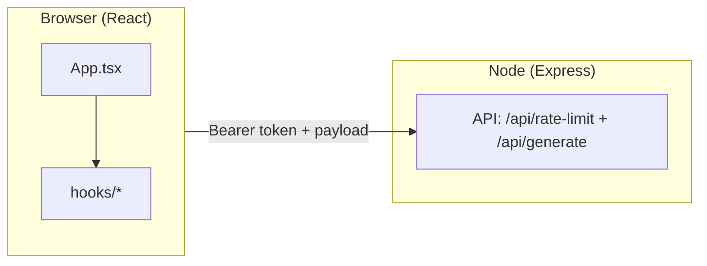
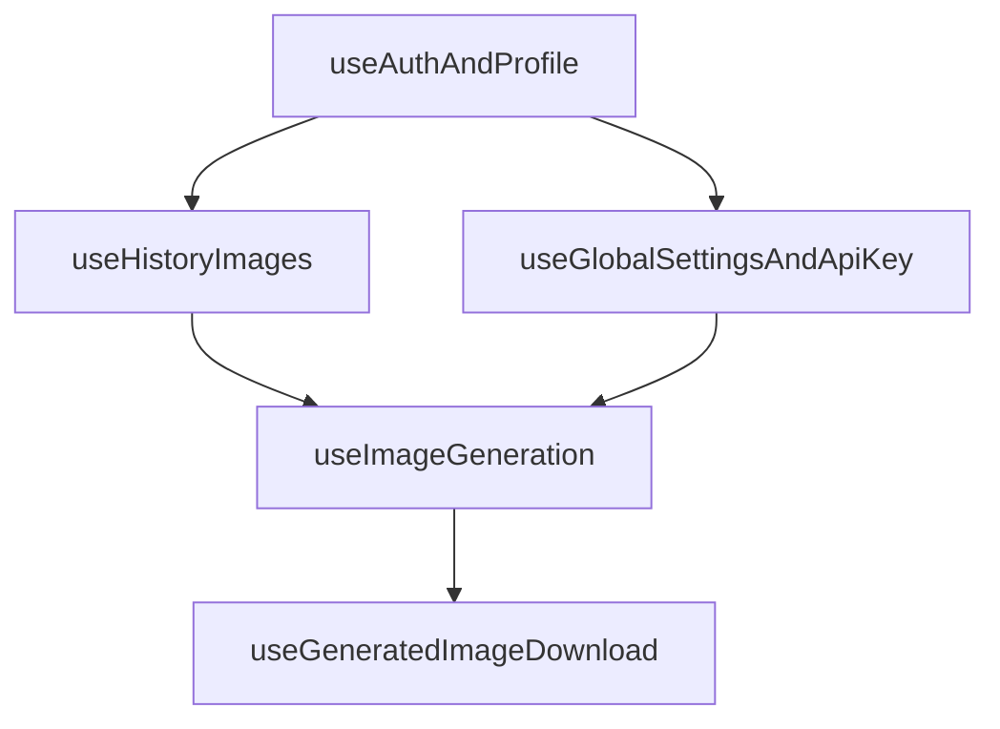

# 02 - Kiến Trúc Frontend

## Stack UI

- React 19 + TypeScript.
- Vite 6 build/dev server.
- Tailwind CSS 4.
- Sonner (toast), Lucide (icons), idb-keyval (IndexedDB).

## Cấu trúc thư mục (rút gọn)

| Đường dẫn                               | Vai trò                                         |
| --------------------------------------- | ----------------------------------------------- |
| `App.tsx`                               | Auth gate, view switch, overlays; lazy `AppAuthenticatedShell`; **GA4** (prod) |
| `components/AppAuthenticatedShell.tsx`  | Shell sau đăng nhập: create/merge/multiple, lazy admin, download |
| `components/admin/`                     | Admin: Users, Settings, lazy Analytics tab (`AdminDashboard.tsx`, tabs, `UserHistoryModal`) |
| `components/analytics/`                 | Analytics dashboard: widgets, trends, cache, `UserHistoryCountsPanel` |
| `components/AdminDashboard.tsx`         | Re-export → `./admin/AdminDashboard` |
| `components/AnalyticsDashboard.tsx`     | Re-export → `./analytics/AnalyticsDashboard` |
| `components/views/CreateView.tsx`       | Màn create chính (banner chào, upload, kết quả) |
| `components/MergeImage.tsx`             | Chế độ trộn nhiều ảnh                           |
| `components/MultipleImage.tsx`          | Chế độ hàng loạt / nhiều biến thể               |
| `components/ImageUploader.tsx`          | Ảnh chính (kéo thả; prop `showLabel`)           |
| `components/ReferenceImageUploader.tsx` | Ảnh tham chiếu (nhiều file)                     |
| `components/ResultsDisplay.tsx`         | Lưới ảnh gốc + kết quả, trạng thái rỗng/loading |
| `components/layout/`                    | Header/Footer/Auth loading + `GeminiModelComparisonModal` (popup so sánh model); header **GA4** `select_content` khi mở popup; nút **Phiên đăng nhập** |
| `components/account/ActiveSessionsModal.tsx` | Danh sách phiên, đăng xuất phiên / phiên khác |
| `repositories/userSessionRepository.ts` | Firestore `users/{uid}/sessions` |
| `utils/authSessionId.ts`                | `zvas_auth_session_id` (localStorage), `buildDeviceLabel` |
| `hooks/`                                | Business logic tách khỏi UI                     |
| `hooks/useUserSessions.ts`              | Đăng ký phiên, heartbeat, revoke, remote logout |
| `hooks/useAdminUsers.ts`                | Admin: users, pending, approve/reject           |
| `hooks/useAdminSettings.ts`             | Admin: `settings/global`, test provider         |
| `hooks/useAnalyticsDashboardData.ts`    | Analytics: bundle tháng, cache TTL, `requestVersion` |
| `lib/buildGenerationPrompts.ts`         | Prompt pipeline                                 |
| `constants/`                            | Model/prompt maps (`aiModels.ts`: Gemini + `normalizeGeminiModelId`)           |
| `types.ts`                              | Core types: `GeneratedImage`, `ImageFile`, **`GlobalSettings`** |
| `services/analyticsTypes.ts`            | Types analytics dùng chung                      |
| `services/analyticsAggregation.ts`      | Pure aggregation (không I/O Firestore)          |
| `services/analyticsService.ts`          | `trackEvent`, `loadMonthlyDashboardBundle`, rollup |
| `services/`                             | API client + analytics I/O                      |
| `utils/`                                | Helper ảnh/runtime env + **`gtagEvent.ts`** (GA4, chỉ `import.meta.env.PROD`) |

## Custom hooks chính

- `useAuthAndProfile`: đăng nhập email/mật khẩu; đọc `users/{uid}` (`getDoc`); `profileGate` (`ready` / `missing` / `error`); `waitForProfileGate` sau login; refetch theo chu kỳ / visibility.
- `components/landing/LandingPage.tsx` + `LoginModal.tsx`: landing và modal đăng nhập (username → `@zvas.local`).
- `components/guards/`: `PendingAccessScreen`, `RejectedAccessScreen`, `AccountGateScreen` (thiếu hồ sơ Firestore).
- `useUserSessions`: sau đăng nhập — ghi `users/{uid}/sessions/{sessionId}`, heartbeat, modal **Phiên đăng nhập**, đăng xuất phiên từ xa (`repositories/userSessionRepository.ts`).
- `useGlobalSettingsAndApiKey`: `settings/global` bằng `**getDoc**` + refetch theo chu kỳ / visibility (không listener liên tục). Trả về `GlobalSettings | null` (typed, không còn `any`).
- `useHistoryImages`: đồng bộ history + IndexedDB.
- `usePendingUsersNotifier`: admin — **`onSnapshot`** Firestore realtime (thay polling 45s); cập nhật tức thì khi có user pending mới.
- `useImageGeneration`: pipeline generate + persist + optimistic update; export thêm `resetGenerationWorkspace()` (tắt loading, xóa ảnh vừa tạo trên UI). Gọi `trackEvent` + **GA4** (`begin_checkout`, `purchase`, `exception`) khi bản production (`utils/gtagEvent.ts`).
- `useGeneratedImageDownload`: tải PNG/JPG + xử lý nền.

## Shell dev/prod

- `npm run dev`: `tsx server.ts` (Express + Vite middleware).
- `npm run build`: build frontend ra `dist/`.
- `npm start`: chạy server production phục vụ static + API.

## Cấu hình Firebase client (local, không commit)

- File `firebase-applet-config.json` có trong `.gitignore`; trong repo chỉ giữ `firebase-applet-config.example.json` làm mẫu.
- Sau khi clone: sao chép example → `firebase-applet-config.json` rồi điền `projectId`, `apiKey`, `firestoreDatabaseId`, v.v. File này được `import` trong `firebase.ts` (bundle Vite) và đọc trong `server.ts` (Firebase Admin: `projectId` + database).
- **Persistence (Firebase 12+):** `firebase.ts` dùng `initializeFirestore` + `persistentLocalCache({ tabManager: persistentMultipleTabManager() })` thay cho `enableMultiTabIndexedDbPersistence` (đã deprecated). Lỗi init cache → fallback `getFirestore()`.
- **Docker / CI:** trước `docker build` cần đặt `firebase-applet-config.json` trong ngữ cảnh build (secret CI hoặc bước generate từ biến môi trường của bạn) — không lấy từ Git.

## Build Vite (chunk splitting)

`vite.config.ts` tách vendor để giảm cảnh báo chunk >500 kB và tải song song:

- `firebase-firestore-vendor`, `firebase-auth-vendor`, `firebase-app-vendor`, `firebase-misc-vendor`
- `recharts-vendor` (lazy cùng Admin/Analytics), `react-vendor`
- `chunkSizeWarningLimit: 600` — SDK Firebase có thể ~560 kB tổng; chia file không giảm tổng dung lượng.

## GA4 và console trình duyệt

- `ERR_BLOCKED_BY_CLIENT` trên `googletagmanager.com`: ad blocker — **không** lỗi app; `gtagEvent.ts` no-op khi không có `window.gtag`.
- Firestore persistence deprecation: đã migrate sang `localCache` API (xem `firebase.ts`).

## Sơ đồ Mermaid

### Tổng thể frontend-to-backend

### Ghép hook trong App

## Shell đăng nhập & hệ giao diện

- **Nền:** `App.tsx` bọc nội dung trong lớp tối (`#05080c`) + gradient radial nhẹ (cyan/blue) để đồng bộ với landing/admin.
- **Header / footer:** `components/layout/AppHeader.tsx`, `AppFooter.tsx` — viền kính (`border-white/[0.08]`), blur; tab chế độ dạng segmented control có icon; các nút icon dùng `cursor-pointer` để rõ hành động bấm; **Phiên đăng nhập** mở `ActiveSessionsModal`.
- **Chọn model (Gemini):** trên header (`sm` trở lên), dropdown **Model** lấy option từ `constants/aiModels.ts` → `PROVIDER_MODEL_OPTIONS.gemini`: **Nano Banana Pro** (`gemini-3-pro-image-preview`), **Nano Banana 2** (`gemini-3.1-flash-image-preview`). Kế bên có nút **info** (`CircleHelp`); khi provider đang là `gemini`, bấm mở `GeminiModelComparisonModal` — nội dung đọc trực tiếp từ `docs/so-sanh-model-gemini.md` qua import Vite `?raw`, render markdown tối giản (tiêu đề, bảng, list, `**bold**`, `` `code` ``). Modal dùng **`createPortal(..., document.body)`** để tránh bị cắt do `backdrop-filter` trên header / `overflow-hidden` shell; `max-w-[820px]`, vùng nội dung cuộn độc lập.
- **Chuẩn hóa model id:** `normalizeGeminiModelId` + `ALLOWED_GEMINI_MODEL_IDS` trong `constants/aiModels.ts` — dùng khi load `settings/global` (Admin), preference `localStorage` key `preferred_generation_models` (`App.tsx`), và `getEffectiveModel()` trong `useGlobalSettingsAndApiKey` để id cũ không còn trong danh sách tự map về fallback hợp lệ.
- **Create / Multiple:** panel phụ (`aside`) dùng nền kính mỏng; CTA chính gradient cyan–blue, bo `rounded-2xl`.

## Logo thương hiệu (AI Image ZVAS)

- Vùng logo là **một nút** gọi `onLogoWorkspaceRefresh` từ `App.tsx`.
- **Ý nghĩa:** làm mới **vùng làm việc** giống F5 phần form: prompt, ảnh chọn, style/options, tỷ lệ, ảnh vừa generate trên UI, đóng fullscreen / style guide / modal admin; **tăng `workspaceMountKey`** để remount nhánh nội dung → reset luôn state nội bộ của **Merge** và **Multiple**.
- **Không làm:** đăng xuất Firebase, `localStorage`/`sessionStorage` (analytics, model preference, v.v.), không `location.reload()`.
- Kỹ thuật: `resetAppState({ preserveView: true })` giữ tab Tạo/Trộn/Hàng loạt; `resetGenerationWorkspace()` từ `useImageGeneration`; `URL.revokeObjectURL` cho blob preview trước khi xóa state ảnh.

## Banner “Chào bạn!” (Create)

- File: `components/views/CreateView.tsx`.
- Có nút đóng (X); khi đóng, ghi `localStorage` key `zvas-create-welcome-dismissed` = `'1'` — lần sau vào màn create banner không hiện (chỉ trên cùng origin/trình duyệt).
- Logo làm mới vùng làm việc **không** xóa key này (user vẫn giữ lựa chọn đã đóng banner).

## Upload & kết quả

- `**ImageUploader`:** prop tùy chọn `showLabel` (mặc định `true`). Ở **Multiple** truyền `showLabel={false}` vì section cha đã có tiêu đề “Hình ảnh gốc”.
- `**ReferenceImageUploader`:** cùng ngôn ngữ giao diện (kính, dashed “Thêm ảnh”, drag highlight); prop `showLabel` tương tự nếu cần tái sử dụng.
- `**ResultsDisplay`:** empty/loading bằng tiếng Việt; thẻ ảnh bo lớn, nút “Dùng làm ảnh gốc”, “Tách nền”; lỗi generate hiển thị dạng thân thiện. `ImageCard` wrap `React.memo`.
- `**utils/fileValidation.ts`:** `isAcceptedImageFile` + `ACCEPTED_IMAGE_TYPES` dùng chung cho 3 uploaders.
- `**PromptManager`:** `React.memo` + `useCallback` trên tất cả handlers — tránh re-render cascade khi parent re-render.

## Firestore — giảm đọc (Admin / Analytics)

- **`components/admin/AdminDashboard`:** logic users/settings trong `useAdminUsers` / `useAdminSettings`; `getDocs` khi mở / sau thao tác; modal lịch sử: `getDocs` (50 mục). `React.lazy` + `Suspense` cho tab Analytics.
- **`App.tsx` / `AppAuthenticatedShell`:** lazy `AdminDashboard` — giảm JS ban đầu.
- **`components/analytics/AnalyticsDashboard`:** data qua `useAnalyticsDashboardData` — không auto-fetch khi đổi tháng; chỉ đọc khi bấm **Yêu cầu dữ liệu**; cache `sessionStorage` TTL 15 phút theo `monthKey`.
- **`TrendsSection`:** mount theo `requestVersion` (sau **Yêu cầu dữ liệu**).
- **`useTrendData`:** cache events theo `range + ngày`; aggregation qua `aggregateTrendPoints` (`analyticsAggregation.ts`).
- **`UserHistoryCountsPanel`:** `aggregateHistoryCountsByUid`; ưu tiên `stats_by_user_month/{YYYY-MM}`; quét history chỉ khi bấm **Cập nhật số ảnh**.
- **Rollup tháng:** `loadMonthlyDashboardBundle` ưu tiên `analytics_monthly_rollups/{YYYY-MM}` (`version: 1`), fallback pagination `analytics_events` (`ANALYTICS_EVENTS_PAGE_SIZE = 500`).

Chi tiết module map: `docs/07-refactor-2026-05.md`

