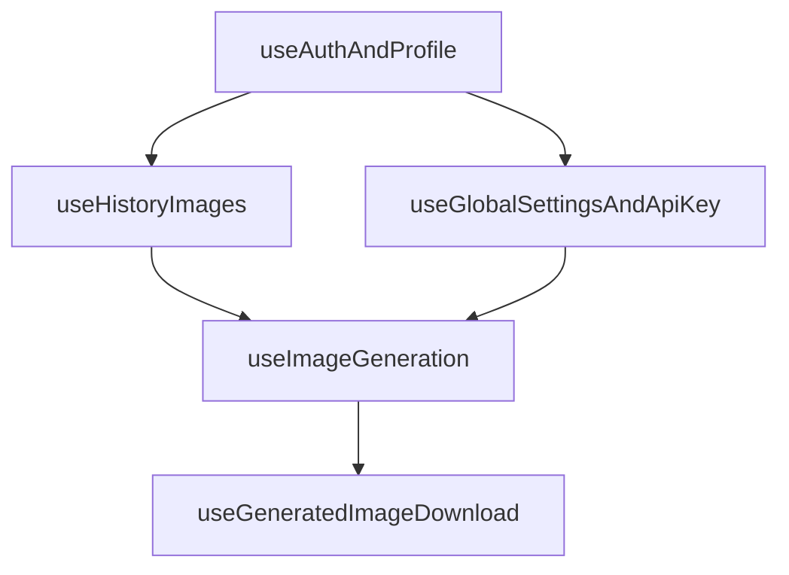

# 02 - Kiến Trúc Frontend

## Stack UI

- React 19 + TypeScript.
- Vite 6 build/dev server.
- Tailwind CSS 4.
- Sonner (toast), Lucide (icons), idb-keyval (IndexedDB).

## Cấu trúc thư mục (rút gọn)


| Đường dẫn                         | Vai trò                                        |
| --------------------------------- | ---------------------------------------------- |
| `App.tsx`                         | Orchestrator: auth gate, view switch, overlays |
| `components/`                     | UI components                                  |
| `components/views/CreateView.tsx` | Màn create chính                               |
| `components/layout/`              | Header/Footer/Auth loading                     |
| `hooks/`                          | Business logic tách khỏi UI                    |
| `lib/buildGenerationPrompts.ts`   | Prompt pipeline                                |
| `constants/`                      | Model/prompt maps                              |
| `services/`                       | API client + analytics service                 |
| `utils/`                          | Helper xử lý ảnh/runtime env                   |


## Custom hooks chính

- `useAuthAndProfile`: đồng bộ Firebase user profile.
- `useGlobalSettingsAndApiKey`: đọc settings/model/provider hiệu lực.
- `useHistoryImages`: đồng bộ history + IndexedDB.
- `usePendingUsersNotifier`: cảnh báo pending users cho admin.
- `useImageGeneration`: pipeline generate + persist + optimistic update.
- `useGeneratedImageDownload`: tải PNG/JPG + xử lý nền.

## Shell dev/prod

- `npm run dev`: `tsx server.ts` (Express + Vite middleware).
- `npm run build`: build frontend ra `dist/`.
- `npm start`: chạy server production phục vụ static + API.

## Sơ đồ Mermaid

### Tổng thể frontend-to-backend

```mermaid
flowchart LR
  subgraph browser [Browser - React]
    App[App.tsx]
    Hooks[hooks/*]
    App --> Hooks
  end

  subgraph server [Node - Express]
    API[/api/rate-limit + /api/generate]
  end

  browser -->|Bearer token + payload| API
```


### Ghép hook trong App




