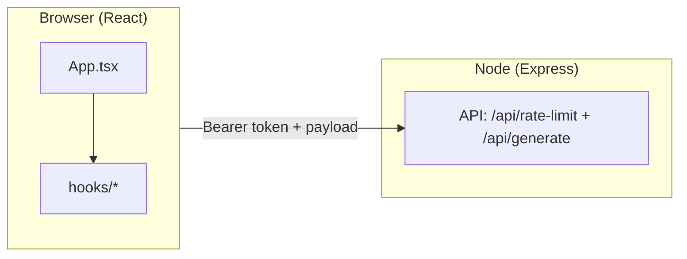
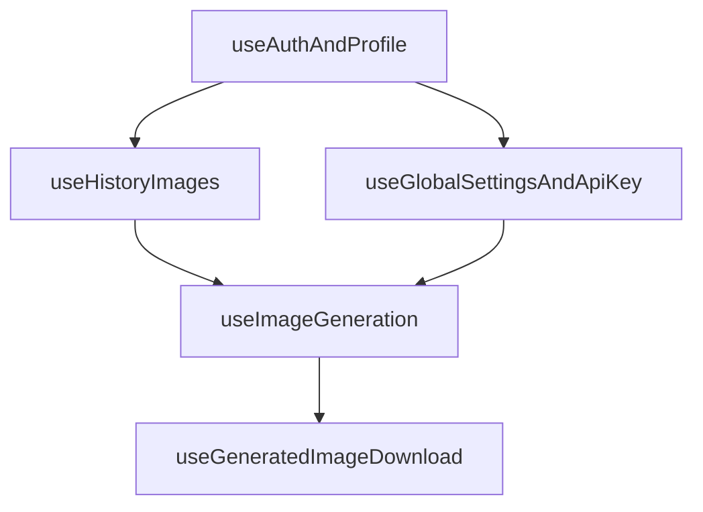

# 02 - Kiến Trúc Frontend

## Stack UI

- React 19 + TypeScript.
- Vite 6 build/dev server.
- Tailwind CSS 4.
- Sonner (toast), Lucide (icons), idb-keyval (IndexedDB).

## Cấu trúc thư mục (rút gọn)

| Đường dẫn                               | Vai trò                                         |
| --------------------------------------- | ----------------------------------------------- |
| `App.tsx`                               | Orchestrator: auth gate, view switch, overlays  |
| `components/`                           | UI components                                   |
| `components/views/CreateView.tsx`       | Màn create chính (banner chào, upload, kết quả) |
| `components/MergeImage.tsx`             | Chế độ trộn nhiều ảnh                           |
| `components/MultipleImage.tsx`          | Chế độ hàng loạt / nhiều biến thể               |
| `components/ImageUploader.tsx`          | Ảnh chính (kéo thả; prop `showLabel`)           |
| `components/ReferenceImageUploader.tsx` | Ảnh tham chiếu (nhiều file)                     |
| `components/ResultsDisplay.tsx`         | Lưới ảnh gốc + kết quả, trạng thái rỗng/loading |
| `components/layout/`                    | Header/Footer/Auth loading                      |
| `hooks/`                                | Business logic tách khỏi UI                     |
| `lib/buildGenerationPrompts.ts`         | Prompt pipeline                                 |
| `constants/`                            | Model/prompt maps                               |
| `services/`                             | API client + analytics service                  |
| `utils/`                                | Helper xử lý ảnh/runtime env                    |

## Custom hooks chính

- `useAuthAndProfile`: profile `users/{uid}` bằng `**getDoc**` + refetch theo chu kỳ / khi quay lại tab (không `onSnapshot`).
- `useGlobalSettingsAndApiKey`: `settings/global` bằng `**getDoc**` + refetch theo chu kỳ / visibility (không listener liên tục).
- `useHistoryImages`: đồng bộ history + IndexedDB.
- `usePendingUsersNotifier`: admin — `**getCountFromServer**` theo chu kỳ + toast khi số pending tăng.
- `useImageGeneration`: pipeline generate + persist + optimistic update; export thêm `resetGenerationWorkspace()` (tắt loading, xóa ảnh vừa tạo trên UI).
- `useGeneratedImageDownload`: tải PNG/JPG + xử lý nền.

## Shell dev/prod

- `npm run dev`: `tsx server.ts` (Express + Vite middleware).
- `npm run build`: build frontend ra `dist/`.
- `npm start`: chạy server production phục vụ static + API.

## Cấu hình Firebase client (local, không commit)

- File `firebase-applet-config.json` có trong `.gitignore`; trong repo chỉ giữ `firebase-applet-config.example.json` làm mẫu.
- Sau khi clone: sao chép example → `firebase-applet-config.json` rồi điền `projectId`, `apiKey`, `firestoreDatabaseId`, v.v. File này được `import` trong `firebase.ts` (bundle Vite) và đọc trong `server.ts` (Firebase Admin: `projectId` + database).
- **Docker / CI:** trước `docker build` cần đặt `firebase-applet-config.json` trong ngữ cảnh build (secret CI hoặc bước generate từ biến môi trường của bạn) — không lấy từ Git.

## Sơ đồ Mermaid

### Tổng thể frontend-to-backend

### Ghép hook trong App

## Shell đăng nhập & hệ giao diện

- **Nền:** `App.tsx` bọc nội dung trong lớp tối (`#05080c`) + gradient radial nhẹ (cyan/blue) để đồng bộ với landing/admin.
- **Header / footer:** `components/layout/AppHeader.tsx`, `AppFooter.tsx` — viền kính (`border-white/[0.08]`), blur; tab chế độ dạng segmented control có icon; các nút icon dùng `cursor-pointer` để rõ hành động bấm.
- **Create / Multiple:** panel phụ (`aside`) dùng nền kính mỏng; CTA chính gradient cyan–blue, bo `rounded-2xl`.

## Logo thương hiệu (AI Image ZVAS)

- Vùng logo là **một nút** gọi `onLogoWorkspaceRefresh` từ `App.tsx`.
- **Ý nghĩa:** làm mới **vùng làm việc** giống F5 phần form: prompt, ảnh chọn, style/options, tỷ lệ, ảnh vừa generate trên UI, đóng fullscreen / style guide / modal admin; **tăng `workspaceMountKey`** để remount nhánh nội dung → reset luôn state nội bộ của **Merge** và **Multiple**.
- **Không làm:** đăng xuất Firebase, `localStorage`/`sessionStorage` (analytics, model preference, v.v.), không `location.reload()`.
- Kỹ thuật: `resetAppState({ preserveView: true })` giữ tab Tạo/Trộn/Hàng loạt; `resetGenerationWorkspace()` từ `useImageGeneration`; `URL.revokeObjectURL` cho blob preview trước khi xóa state ảnh.

## Banner “Chào bạn!” (Create)

- File: `components/views/CreateView.tsx`.
- Có nút đóng (X); khi đóng, ghi `localStorage` key `zvas-create-welcome-dismissed` = `'1'` — lần sau vào màn create banner không hiện (chỉ trên cùng origin/trình duyệt).
- Logo làm mới vùng làm việc **không** xóa key này (user vẫn giữ lựa chọn đã đóng banner).

## Upload & kết quả

- `**ImageUploader`:** prop tùy chọn `showLabel` (mặc định `true`). Ở **Multiple** truyền `showLabel={false}` vì section cha đã có tiêu đề “Hình ảnh gốc”.
- `**ReferenceImageUploader`:** cùng ngôn ngữ giao diện (kính, dashed “Thêm ảnh”, drag highlight); prop `showLabel` tương tự nếu cần tái sử dụng.
- `**ResultsDisplay`:** empty/loading bằng tiếng Việt; thẻ ảnh bo lớn, nút “Dùng làm ảnh gốc”, “Tách nền”; lỗi generate hiển thị dạng thân thiện.

## Firestore — giảm đọc (Admin / Analytics)

- `**AdminDashboard`:** danh sách `users` bằng `**getDocs`** khi mở / sau thao tác; modal lịch sử user: `**getDocs`** (50 mục), không `onSnapshot`. `**React.lazy`** + `**Suspense`** cho `AnalyticsDashboard` (chunk tách khi mở tab Analytics).
- `**App.tsx`:** `**React.lazy`** + `**Suspense`** cho `AdminDashboard` — giảm JS ban đầu cho user không mở admin.
- `**AnalyticsDashboard`:** không auto-fetch khi mở trang/đổi tháng. Chỉ đọc Firestore khi user bấm nút **Yêu cầu dữ liệu**; sau đó cache `**sessionStorage`** TTL 15 phút theo `monthKey`.
- `**DeferredTrendsSection`:** mount theo `requestVersion` (sau khi bấm **Yêu cầu dữ liệu**) để tránh query ngầm trước khi user yêu cầu.
- `**useTrendData`:** thêm cache events dùng chung theo `range + ngày` (in-memory + pending promise dedupe) để đổi metric không lặp lại read cùng tập `analytics_events`.
- `**UserHistoryCountsPanel`:** `**getDocs(users)`** + đếm `history` theo tháng: ưu tiên doc `**stats_by_user_month/{YYYY-MM}`**; nếu thiếu thì **không auto quét history**, chỉ quét khi user bấm **Cập nhật số ảnh**.
- `**analytics_events`:** repository đọc theo trang (`**limit` + `startAfter`**, `ANALYTICS_EVENTS_PAGE_SIZE`) và hạn chế quét lặp bằng cache tầng hook.

