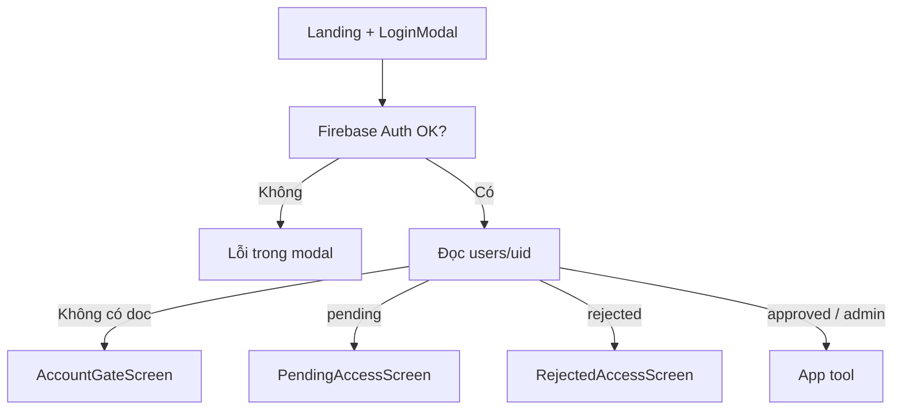
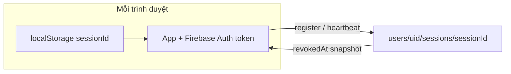

# 08 - Đăng nhập & tài khoản người dùng

Hướng dẫn cấu hình **Firebase Auth (email/mật khẩu)** + document Firestore `users/{uid}` — bắt buộc để vào app sau khi đăng nhập.

## Tóm tắt luồng

1. User nhập **tên đăng nhập** + **mật khẩu** trên landing (`LoginModal`).
2. Client chuyển username → email nội bộ: `tenban` → `tenban@zvas.local` (`utils/authCredentials.ts`).
3. `signInWithEmailAndPassword` (Firebase Auth).
4. App đọc Firestore **`users/{uid}`** — `uid` là UID từ Auth, **không** phải username.
5. Theo `status` và `role`:
   - `approved` (hoặc `admin`) → vào tool (`AppAuthenticatedShell`).
   - `pending` → màn chờ duyệt.
   - `rejected` → màn từ chối.
   - Không có document → màn **Tài khoản chưa được cấu hình** (không tự logout im lặng).



## Document `users/{uid}`

| Field | Bắt buộc | Ghi chú |
| ----- | -------- | ------- |
| `uid` | Có | Trùng Firebase Auth UID |
| `email` | Có | Thường `{username}@zvas.local` |
| `username` | Có | Tên đăng nhập hiển thị |
| `role` | Có | `admin` \| `editor` \| `advice` |
| `status` | Có | `approved` \| `pending` \| `rejected` |
| `displayName` | Khuyến nghị | |
| `photoURL` | Tuỳ chọn | `null` |
| `createdAt` | Khuyến nghị | ISO string |

**Lỗi thường gặp:** tạo document với ID = `admin` thay vì UID → app vẫn báo “chưa được cấu hình”.

### Ví dụ (Console)

- Database Firestore: id trong `firebase-applet-config.json` → `firestoreDatabaseId` (named DB, không phải `(default)`).
- Collection: `users`
- Document ID: `5xVmZdhTPiXzCPiVhTjgYWOi9ai1` (ví dụ UID user `admin`)
- Fields: `uid`, `email` = `admin@zvas.local`, `username` = `admin`, `role` = `admin`, `status` = `approved`

## Firebase Admin (local dev)

API server (`POST /api/admin/users`, `requireAdmin`, script provision) cần **Firebase Admin SDK** có credential.

`server/firebaseAdmin.ts` tự tìm file (theo thứ tự):

1. `GOOGLE_APPLICATION_CREDENTIALS` (env)
2. `service-account.json` ở thư mục gốc project

**Lưu ý:** tên file phải đúng `service-account.json` — **không** có khoảng trắng đầu tên (` service-account.json` sẽ không khớp nếu chỉ set env trỏ path không space).

File JSON đã có trong `.gitignore` (`service-account*.json`). Không commit.

### `.env.local` (gợi ý)

```bash
GEMINI_API_KEY=...
SEEDREAM_API_KEY=...
GOOGLE_APPLICATION_CREDENTIALS=/absolute/path/to/zvas-ai-image/service-account.json
```

Restart `npm run dev` sau khi thêm/sửa credential.

## Tạo user qua Admin UI

`POST /api/admin/users` (Bearer token admin):

- Tạo user Firebase Auth (`email` = `{username}@zvas.local`).
- Ghi document `users/{uid}` với `status: approved`.

Yêu cầu:

- Người gọi API có profile `users/{uid}` với `role: admin`.
- Server load được service account (xem trên).

Lỗi HTTP:

| Mã | Ý nghĩa |
| --- | -------- |
| 401 | Thiếu / token không hợp lệ |
| 403 | Không phải admin |
| 409 | Email/username đã tồn tại (`auth/email-already-exists`) |
| 503 | Server thiếu Firebase Admin credential |
| 500 | Lỗi khác (xem log terminal `npm run dev`) |

## Script: gắn hồ sơ cho UID đã có trên Auth

Khi user đã login được Auth nhưng thiếu Firestore profile:

```bash
GOOGLE_APPLICATION_CREDENTIALS=./service-account.json \
npm run provision-user -- \
  --uid <FIREBASE_AUTH_UID> \
  --username admin \
  --role admin \
  --status approved
```

Script: `scripts/provision-user-profile.ts` — merge `set` document `users/{uid}`.

## Collection `history`

- Client query: `where('uid', '==', auth.uid)` + `orderBy('createdAt', 'desc')`.
- Rules: user chỉ đọc/ghi document có `resource.data.uid == request.auth.uid`.
- Index: `firestore.indexes.json` (composite `uid` + `createdAt`).

Deploy rules sau khi sửa:

```bash
firebase deploy --only firestore:rules --project zvas-ai-image
```

## Phiên đăng nhập đa thiết bị

Một tài khoản có thể **đăng nhập và dùng app đồng thời** trên nhiều trình duyệt hoặc thiết bị. App theo dõi từng phiên trong Firestore và cho phép user xem / đăng xuất từng phiên.

### Lưu trữ

| Thành phần | Giá trị |
| ---------- | ------- |
| Đường dẫn Firestore | `users/{uid}/sessions/{sessionId}` (subcollection) |
| ID phiên local | `localStorage` key `zvas_auth_session_id` (UUID) |
| Rules | `allow read, create, update: if isOwner(userId)` — cùng quyền với `users/{uid}` |

**Lưu ý:** Phiên bản cũ dùng collection root `user_sessions` đã **bỏ**. Chỉ dùng subcollection dưới `users/{uid}`.

### Dùng song song được không?

| Tình huống | Số phiên Firestore | Ghi chú |
| ---------- | ----------------- | ------- |
| Chrome máy A + Firefox máy B | 2 | Dùng đồng thời được |
| Chrome + Edge cùng máy | 2 | Profile/localStorage riêng |
| Nhiều tab cùng Chrome | 1 | Chung `localStorage` |
| Chrome thường + Incognito | 2 | Profile riêng |

### Luồng kỹ thuật

1. Sau khi vào `AppAuthenticatedShell`, hook `useUserSessions` gọi `registerOrTouchUserSession(uid)`.
2. `waitForAuthReady()` + `getIdToken()` trước mọi đọc/ghi Firestore (tránh race `permission-denied`).
3. `setDoc` hoặc `updateDoc` doc phiên; heartbeat `lastActiveAt` mỗi ~60s và khi tab visible.
4. `onSnapshot` trên doc phiên hiện tại — nếu `revokedAt` → toast + `signOut`.
5. Đăng xuất thường: `revokeUserSession(uid, sessionId)` rồi `signOut`.



### Schema `users/{uid}/sessions/{sessionId}`

| Field | Mô tả |
| ----- | ----- |
| `sessionId` | Trùng document ID |
| `uid` | Firebase Auth UID |
| `deviceLabel` | Ví dụ `Chrome · macOS` |
| `userAgent`, `platform` | Metadata thiết bị (rút gọn) |
| `createdAt`, `lastActiveAt` | `serverTimestamp()` |
| `revokedAt` | `null` hoặc timestamp khi đăng xuất phiên |

### UI

- Header → nút **Phiên đăng nhập** (`MonitorSmartphone`) → `ActiveSessionsModal`.
- **Đăng xuất phiên** — thu hồi phiên khác hoặc phiên hiện tại (phiên hiện tại → đăng xuất Firebase).
- **Đăng xuất tất cả phiên khác** — ghi `revokedAt` cho mọi phiên trừ phiên đang dùng.

### Giới hạn (chưa implement)

- **Không** giới hạn “chỉ 1 thiết bị” khi đăng nhập mới.
- **Không** revoke refresh token Firebase toàn cục (Admin `revokeRefreshTokens`) — thu hồi phiên chỉ chặn qua flag Firestore + listener; thiết bị kia có thể còn token Auth đến khi hết hạn hoặc đến lần app kiểm tra phiên.
- **Không** tách phiên theo từng tab (cần `sessionStorage` thay `localStorage` nếu muốn).

### Deploy rules / index

```bash
firebase deploy --only firestore:rules,firestore:indexes --project zvas-ai-image
```

Index: collection group `sessions`, field `lastActiveAt` DESC (query list phiên theo user).

## Troubleshooting nhanh

| Triệu chứng | Nguyên nhân / cách xử lý |
| ----------- | ------------------------- |
| Đăng nhập xong vẫn ở landing, không lỗi | Thiếu `users/{uid}` → tạo doc hoặc `npm run provision-user` |
| Modal báo sai mật khẩu | Kiểm tra Auth email `user@zvas.local` |
| Màn “chưa được cấu hình” | Document ID phải là **UID**, không phải username |
| `POST /api/admin/users` 500 | Thiếu `service-account.json` / restart dev server |
| History `permission-denied` | Deploy rules + đúng named database |
| Admin không vào được | `users/{adminUid}` cần `role: admin`, `status: approved` |
| `registerOrTouchUserSession` permission-denied | Deploy rules; đúng DB `firestoreDatabaseId`; không dùng collection `user_sessions` cũ |
| Snapshot listener permission-denied | Cùng nguyên nhân rules; hard refresh sau deploy |

## File liên quan

| File | Vai trò |
| ---- | ------- |
| `utils/authCredentials.ts` | `resolveLoginEmail`, `emailForAdminUsername` |
| `utils/authSessionId.ts` | `getOrCreateLocalSessionId`, `buildDeviceLabel` |
| `hooks/useAuthAndProfile.ts` | Login, profile gate, logout + revoke phiên |
| `hooks/useUserSessions.ts` | Đăng ký phiên, list, revoke, remote logout |
| `repositories/userSessionRepository.ts` | Firestore CRUD `users/{uid}/sessions` |
| `components/account/ActiveSessionsModal.tsx` | UI quản lý phiên |
| `components/landing/LoginModal.tsx` | UI đăng nhập |
| `components/guards/AccountGateScreen.tsx` | Thiếu / lỗi hồ sơ |
| `components/layout/AppHeader.tsx` | Nút mở modal phiên |
| `server/routes/adminUsers.ts` | API tạo user |
| `server/firebaseAdmin.ts` | Admin SDK + credential |
| `firestore.rules` | `users`, `users/.../sessions`, `history` |
| `firestore.indexes.json` | Index `sessions` + `lastActiveAt` |
